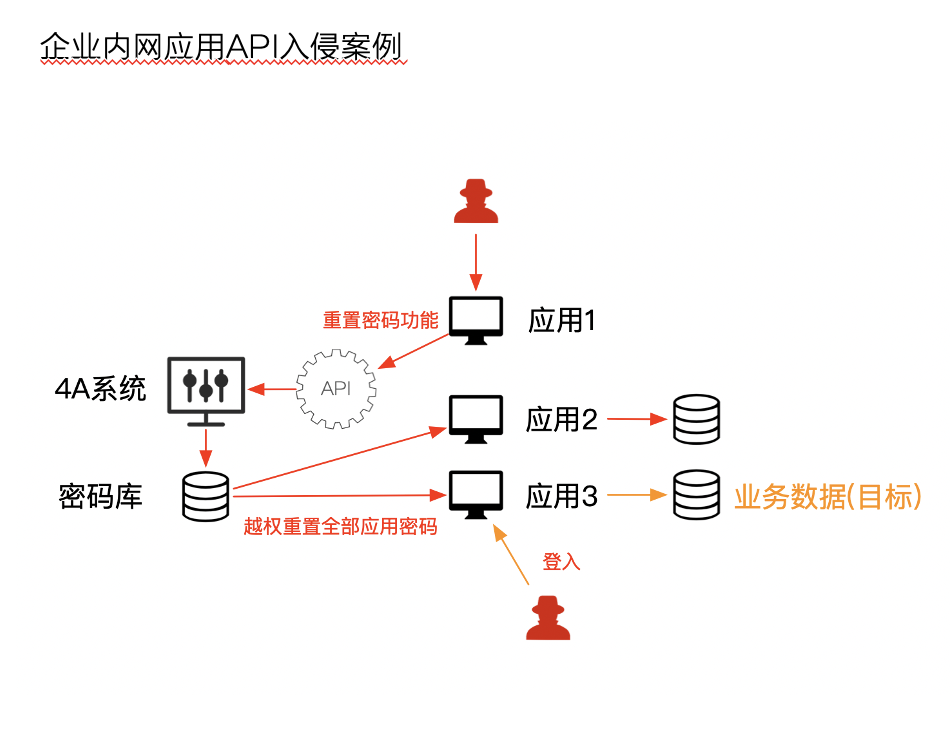
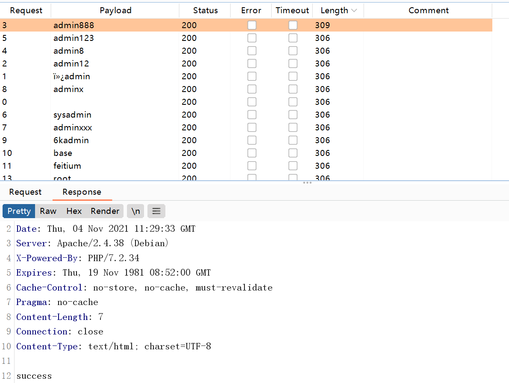
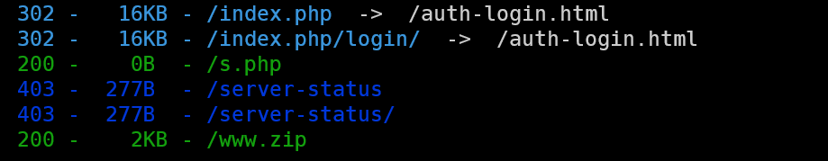
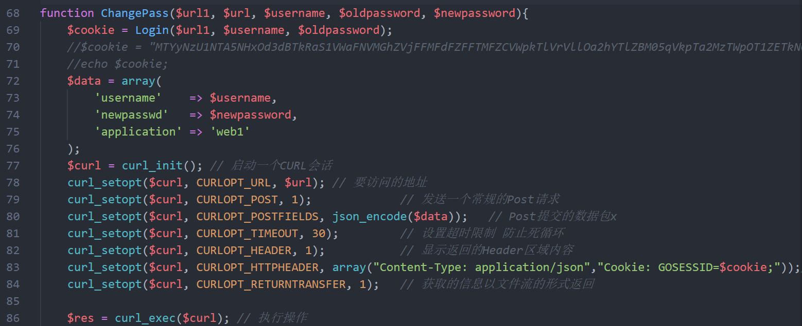
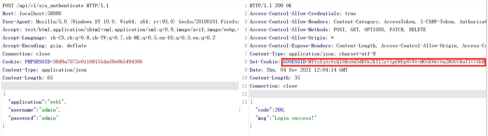
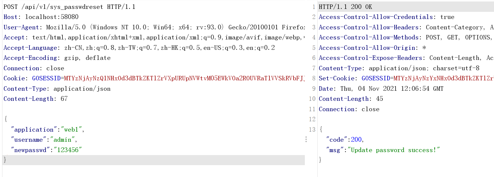
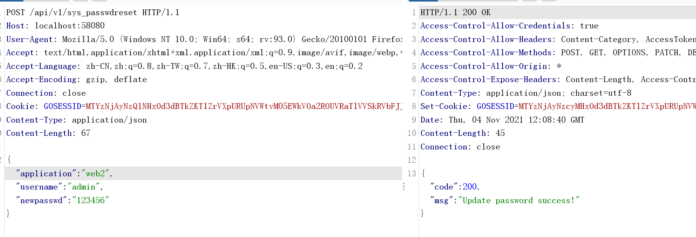
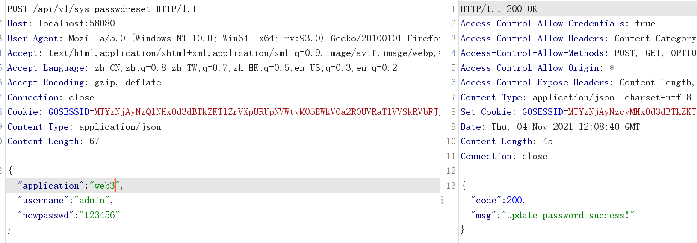
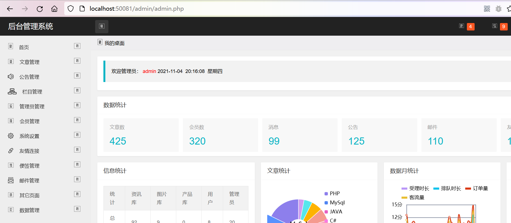

# 4ASystem

## 概述

总共四个web站，一个4a系统，三个应用分别为web1 web2 web3。同一个用户名三个系统的密码不一样，无法撞库攻击。

4A API:  

1. 登录验证 输入 应用名、用户名、密码 返回成功/失败
2. 改密码 输入 应用名 用户名 新密码 返回成功/失败

web1，登录密码进入后台，重置密码功能界面输入：用户名、老密码、新密码。后端往4a系统的api验证用户名密码正确之后，后端对4a系统api发起改密码请求，发送：应用名（web1）、用户名、新密码。登录、验证密码、改密码请求均由web1后端对4a系统发起。

攻击过程：审计发现对4a系统api调用未验证新密码，越权更改web2、web3的密码。



用户名密码：

web1弱口令，web2/3容器启动时随机生成

使用`docker logs <container_id>`查看4asystem的日志：

内容为：

```
sql.db does not exist!
create sql.db success!

		####################################################
		##  web1: admin/admin888                          ##
		##  web2: admin/638ef46bd9053f30932c7d4ce08bb2f8  ## 
		##  web3: admin/e1168c6a97223bac0b0aef9ab8682fb4  ##
		####################################################
...
```


## 弱口令登陆Web1应用

攻击者通过弱口令字典暴力破解出web1应用的口令




## 源代码泄露和审计

通过扫描目录发现源码泄露



审计代码发现4a系统api调用未验证新密码



## 横向越权

模拟登陆web1应用，获得访问API的凭证



修改application值，越权修改web2、3应用的密码





登陆web2成功


